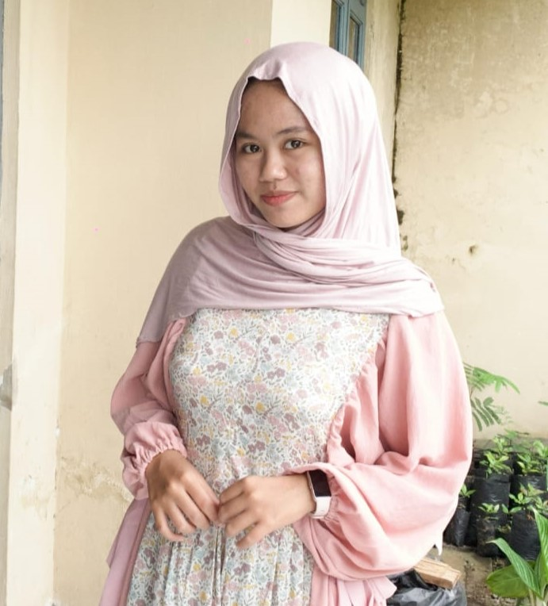

# 💼 Website Portofolio - Ainnunnissa Soraya

Selamat datang di repositori website portofolio pribadi milik **Ainnunnissa Soraya**. Situs ini dibuat menggunakan **HTML**, **CSS**, dan **JavaScript**, sebagai media untuk memperkenalkan profil diri, keterampilan, pengalaman organisasi, hasil karya, serta menyediakan akses ke sertifikat dan media favorit.

## 📂 Struktur Proyek
```
project-portofolio/
│
├── index.html              # Halaman utama
├── asset/
│   ├── css/
│   │   └── custome.css     # Styling keseluruhan halaman
│   └── js/
│       └── script.js       # Interaksi dan animasi
├── img/                    # Gambar profil & proyek
├── ikon/                   # Ikon proyek berbasis gambar
├── sertifikat/             # Gambar sertifikat kegiatan
└── README.md               # Dokumentasi ini
```

## 🔧 Fitur & Komponen

### 🌟 Navigasi & Tema
- Navigasi responsif dengan **hamburger menu**
- Perpindahan antar section menggunakan **smooth scrolling**
- Fitur **dark & light mode** yang dapat diubah secara real-time

### 👤 Hero & Profil
- Tampilan foto profil berbentuk lingkaran
- Nama lengkap dan kutipan motivasi personal
- Tautan sosial media ke Instagram & LinkedIn

### 🧠 Tentang Saya
- Deskripsi singkat mengenai latar belakang pendidikan dan minat
- Visualisasi keterampilan: **Photography**, **Videography**, dan **Editing**
- Riwayat pendidikan & organisasi dalam format timeline

### 🏆 Sertifikat
- Galeri berisi 6 sertifikat penting yang ditampilkan dengan layout grid
- Efek hover interaktif yang memperbesar tampilan gambar

### 🎥 Portfolio
- Kumpulan hasil karya seperti film pendek, iklan, dan proyek simulasi
- Disusun dalam **grid layout responsif** dengan efek visual ringan

### 🎨 Hobi
- Tampilan daftar hobi menggunakan **kartu warna** yang menarik dan interaktif

### 📻 Media Favorit
- Embed lagu Spotify dan video YouTube
- Konten personal yang mencerminkan kepribadian kreatif

### 📩 Form Kontak
- Formulir sederhana dengan validasi input
- Dirancang untuk menerima pesan dari pengunjung

### 🧠 Fitur Interaktif
- 🌙 **Toggle Tema Gelap/Terang**
- ⏳ **Loading Spinner** saat halaman dimuat
- 🎯 **Animasi scroll (slide-up)** setiap elemen tampil
- 🔼 **Tombol Back to Top** saat halaman discroll ke bawah

---

## 🎨 Desain & Tampilan

- Desain **minimalis dan feminin**, didominasi warna pink (`#e91e63`) dan putih
- Font: `Poppins` dari Google Fonts
- Layout menggunakan **Flexbox** & **CSS Grid**
- Responsif di berbagai ukuran layar

## 🛠 Teknologi yang Digunakan
- HTML5
- CSS3
- JavaScript (ES6+)

---

## 📸 Preview


---

## 🚀 Cara Menjalankan
1. Unduh atau clone repository:
   ```bash
   git clone https://github.com/kamu-user/nama-repo.git
   ```
2. Buka file `index.html` di browser apa pun.

---

## 🛠️ Kustomisasi
- Edit teks, gambar, dan warna di file `index.html` & `custome.css`
- Tambah proyek baru di bagian `#portfolio`
- Perbarui skill dan social media di bagian hero/about
- Tambahkan sertifikat baru di folder `sertifikat/`

---

## 📬 Kontak Saya
Silakan isi form kontak pada halaman, atau kunjungi:
- 📸 Instagram: [@nissasry_](https://www.instagram.com/nissasry_)
- 💼 LinkedIn: [Ainnunnissa Soraya](https://www.linkedin.com/in/ainnunnissa-s-48715432b/)
- 📧 Email: nissa5244@gmail.com

---

© 2025 | Dibuat sepenuh hati oleh **Ainnunnissa Soraya** 💖
